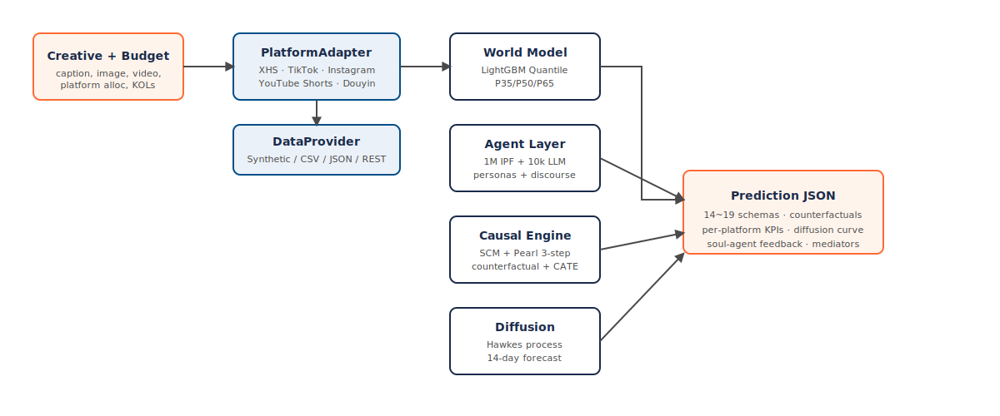

<div align="center">


### 商业级因果数字孪生 · 营销效果预测平台

<p>
  <a href="https://github.com/ORAN-cgsj/oransim/blob/main/LICENSE"></a>
  <a href="https://pypi.org/project/oransim/"></a>
  <a href="https://pypi.org/project/oransim/"></a>
  <a href="https://github.com/ORAN-cgsj/oransim/actions/workflows/ci.yml"></a>
  <a href="https://github.com/ORAN-cgsj/oransim/stargazers"></a>
  <a href="https://oran.cn/oransim"></a>
</p>

<p>
  <a href="README.md">🇬🇧 English</a> · <strong>🇨🇳 中文</strong>
</p>

<p><em>推理 · 模拟 · 干预<br/>在一分钱都没花之前，预测每一个营销决定的效果。</em></p>
</div>

---

## 一句话介绍

**Oransim** 是一个开源的**因果数字孪生**框架，用于营销效果预测。上传素材、预算、KOL 清单 —— 60 秒内返回：

- 📈 预测曝光 / 点击 / 转化 / ROI（带校准的 P35/P50/P65 不确定区间）
- 🔄 **反事实分析** —— 「换个素材 / 多 50% 预算 / 换个 KOL 会怎样？」—— 走 Pearl `do()` + 专用反事实头
- 🗣️ 10 个 LLM 虚拟用户的自然语言反馈
- 📊 14 天扩散曲线 + 干预 rollout
- 🧭 下一步行动建议（按优先级排序）

### 因果栈（causal-first，反事实是一等公民）

- 🧠 **因果 Transformer 世界模型 (Causal Transformer World Model)** —— 6 层多头 self-attention，显式 *treatment / covariate / outcome* 三类 token 分解、DAG-aware 注意力偏置、per-arm 反事实头、表征平衡损失。融合近年因果 Transformer 研究：**CaT** (Melnychuk et al. ICML 2022)、**CausalDAG-Transformer**、**BCAUSS**、**CInA** (Arik & Pfister NeurIPS 2023)、**TARNet / Dragonnet**。([架构细节](#causal-transformer-world-model))
- ⚡ **因果神经 Hawkes 过程 (Causal Neural Hawkes Process)** —— Transformer 参数化的时序点过程，14 天扩散预测，*treatment vs control* 事件类型区分、干预感知强度函数。建立在 **Mei & Eisner (NeurIPS 2017)**、**Zuo et al. (ICML 2020)**、**Geng et al. (NeurIPS 2022) 因果 TPP** 之上。([架构细节](#causal-neural-hawkes-process))
- 🌐 **64 节点结构因果模型 (SCM)** —— Pearl 三步反事实（溯因 → 干预 → 预测），手工设计的营销漏斗图（117 条边），含群体话语（Sunstein 2017）与信息级联的 mediator。
- 👥 **百万级虚拟人口** —— IPF 迭代比例拟合（Deming & Stephan 1940）baseline 对齐人口学先验；可插拔 `PopulationSynthesizer` 接口，Bayesian Network（v0.2）· CTGAN（v0.5）· **Causal-DAG-guided TabDDPM**（v1.0 研究项目）在路线图。取最显著 10k agent 升级为 LLM 驱动人格。
- 🧪 **LightGBM Quantile baseline** —— 快速零依赖 fallback，每 KPI 三个分位数回归器（P35/P50/P65）。保留用于生产延迟敏感场景 + 基准对比。

**开箱即跑** —— v0.2 仓库自带合成 demo 数据集（2.3 MB，200 KOL / 2k scenarios / 100 event streams）**和预训 LightGBM demo pkl**（2.7 MB，合成数据 R² 0.69–0.89）。git clone、pip install、配好 LLM API key，完整预测链路立即能跑——无需先训练。研究级因果 Transformer 和因果神经 Hawkes 当前 ship **架构 + 训练 loop + 推理代码**（`pip install 'oransim[ml]'` 解锁）；**预训权重刻意延后** ——要等 [OrancBench v0.5](ROADMAP.md#v05--mid-q4-2026--q1-2027) 的因果原生评测任务（confounded treatment · CATE heterogeneity · temporal intervention）就位，且这俩架构在这些任务上能展示对 LightGBM baseline 的实质性优势。优先诚实，不做表面工夫。

> 🏢 **企业版** —— OranAI 在**持续更新的真实自有数据**（100 万+ 标注 campaign）上训练同一套架构，提供**效果更优的垂类模型**（美妆 / 服装 / 3C / 食饮 / 奢品 / 汽车）和**模型定制服务**（私有化部署、领域专属 DAG、品牌专属人格库）。联系：`cto@orannai.com`。

---

## 🚀 一分钟上手

```bash
# 1. 克隆 + 安装
git clone https://github.com/ORAN-cgsj/oransim.git
cd oransim
pip install -e '.[dev]'

# 2. 启动后端（mock 模式 —— 不需要 API key）
LLM_MODE=mock PORT=8001 python backend/run.py &

# 3. 启动前端
python -m http.server 8090 --directory frontend

# 4. 浏览器打开 http://localhost:8090 → 点 "🔥 爆款预设" → "🚀 预测"
```

想用真 LLM？设置 `LLM_MODE=api` + `LLM_BASE_URL` + `LLM_API_KEY` + `LLM_MODEL`。详见 [docs/zh/quickstart.md](docs/zh/quickstart.md)。

> **注意**：v0.1.0-alpha 只含骨架代码，完整后端（含前端 demo 和截图）在 v0.2 到位（见 [ROADMAP.md](ROADMAP.md)）。关注仓库等待后续更新。

---

## ✨ 为什么选 Oransim

|  | 传统分析工具 | AutoML / 黑盒预测 | **Oransim** |
|---|---|---|---|
| 世界模型 | 规则模板 | 树 / GBDT / 通用 DNN | ✅ **因果 Transformer**（CaT / CausalDAG-Transformer），显式 treatment/covariate/outcome 分解 |
| 反事实预测 | ❌ | ❌ | ✅ **Per-arm 反事实头**（TARNet / Dragonnet）+ Pearl 三步 `do()` 反事实 |
| 因果偏差矫正 | ❌ | ❌ | ✅ **表征平衡损失**（HSIC / 对抗 IPTW，BCAUSS） |
| 因果图结构 | ❌ | ❌ | ✅ **DAG-aware 注意力**，64 节点 Pearl SCM（117 条边） |
| 扩散预测 | 线性衰减 | 通用时序 DNN | ✅ **因果神经 Hawkes**（Transformer Hawkes + Geng 2022 干预 TPP） |
| Agent 粒度模拟 | ❌ | ❌ 仅聚合 | ✅ 1M IPF 校准虚拟消费者 + 10k LLM 人格 agent |
| 多平台覆盖 | 单平台 | 单平台 | ✅ **PlatformAdapter × DataProvider** 两轴扩展 |
| 预算饱和建模 | ❌ 线性 | ❌ 线性 | ✅ Hill 饱和（Dubé & Manchanda 2005）+ 频次疲劳（Naik & Raman 2003） |
| 可解释性 | 一般 | 低（最多 SHAP） | ✅ SCM 路径 + per-head attention + agent 推理链 |
| 摊销推断 | ❌ | 每个场景重训 | ✅ **In-context 摊销**（CInA, Arik & Pfister NeurIPS 2023） |
| 成本 | License 费 | API 费 | ✅ Apache-2.0 + 自部署（`[ml]` extras 可选） |

做这个项目的人不满两头 —— 学术模拟器不落地、企业工具不解释。我们想把两头好的一面拧在一起。

---

## 🏗️ 架构

<div align="center">

</div>

一次典型预测链路：**素材 + 预算** → **PlatformAdapter**（经可插拔 **DataProvider** 取数据）→ **因果 Transformer 世界模型**（事实 + per-arm 反事实分位数预测）+ **Agent 层**（1M IPF + 10k LLM 人格）→ **因果引擎**（64 节点 Pearl SCM + 三步 `do()` 反事实）→ **因果神经 Hawkes**（14 天扩散 + 干预 rollout）→ **预测 JSON**（14-19 个 schema）。*LightGBM quantile 和参数化 Hawkes 通过 registry 作为快速 baseline 可用。*

两轴可扩展：
- **平台轴** —— 当前 XHS，TikTok / Instagram / YouTube Shorts / Douyin 在路线图
- **数据轴** —— 每平台多数据源插件（Synthetic / CSV / JSON / OpenAPI / 自定义）

完整设计见 [`docs/zh/architecture.md`](docs/zh/architecture.md)。

---

## 🌐 平台 Adapter 矩阵

| 平台                 | 区域      | 状态    | 数据源                                | 世界模型              | 里程碑 |
|----------------------|-----------|---------|---------------------------------------|-----------------------|--------|
| 🔴 小红书 / XHS      | 大中华区  | ✅ v1   | Synthetic / CSV / JSON / OpenAPI    | 因果 Transformer + LightGBM baseline | — |
| ⚫ TikTok            | 全球      | 🟢 MVP  | Synthetic                            | LightGBM baseline     | v0.5（接真 panel） |
| 🟣 Instagram Reels   | 全球      | 🟡 stub | —                                     | —                     | v0.5（2026 Q4） |
| 🔴 YouTube Shorts    | 全球      | 🟡 stub | —                                     | —                     | v0.7（2027 Q1） |
| 🔵 抖音 / Douyin     | 大中华区  | 🟢 MVP  | Synthetic                            | LightGBM baseline     | v0.5（接真 panel） |
| ⚪ Twitter / X       | 全球      | 📋 规划 | —                                    | —                     | v0.5 |
| 📺 Bilibili          | 大中华区  | 📋 规划 | —                                    | —                     | v1.0 |
| ✒️ LinkedIn          | 全球      | 📋 规划 | —                                    | —                     | v1.0 |

**想要其他平台？** 提 [Adapter Request](https://github.com/ORAN-cgsj/oransim/issues/new?template=adapter_request.yml) —— 我们根据社区需求优先级排序。

---

## 📊 输出 Schema（14-19 个）

一次 `/api/predict` 调用返回下列 schema：

1. **total_kpis** —— 总曝光 / 点击 / 转化 / 成本 / 收入 / CTR / CVR / ROI（P35/P50/P65 区间）
2. **per_platform** —— 各平台 KPI 分解
3. **per_kol** —— KOL 层面归因
4. **diffusion_curve** —— 14 天日维度曝光/互动预测（因果神经 Hawkes 主预测器，参数化 Hawkes 作为 baseline）
5. **cate** —— 条件平均处理效应（按 agent 人口学切片）
6. **counterfactual** —— 反事实分支：换素材/加预算/换 KOL 的对比
7. **soul_feedback** —— 10 个 LLM 人格的自然语言反馈
8. **group_chat** —— 群聊动态模拟（Sunstein 2017 群体极化）
9. **discourse** —— 二次传播 mediator 影响估计
10. **final_report** —— LLM 生成的执行摘要
11. **verdict** —— 一句话决策建议（放行/优化/毙掉）
12. **kol_optimizer** —— 目标下的最优 KOL 组合
13. **kol_content_match** —— 素材 × KOL 匹配打分
14. **tag_lift** —— tag/定向选择的增量贡献
15. **mediator_impact** —— 从 discourse/group_chat 到漏斗的路径分析
16. **brand_memory** —— 纵向品牌偏好更新
17. **sandbox_snapshot** —— 会话快照，支持"撤销/重做"
18. **audit_trace** —— 可解释性 —— 哪些 agent、哪些路径、哪些权重
19. **benchmark** —— OrancBench 比对分数

JSON schema 定义见 [`docs/zh/schemas/`](docs/zh/schemas/)。

---

## 🧠 技术细节

<details>
<summary><b>结构因果模型 SCM</b> —— 64 节点、117 条边</summary>

Pearl 的 SCM 框架（Pearl 2009）+ 三步反事实：
1. **溯因（Abduction）** —— 在给定证据下更新隐变量分布
2. **干预（Action）** —— 施加 `do()` 干预
3. **预测（Prediction）** —— 在改造后的 SCM 上前向传播

图是由领域专家手工设计的，覆盖营销漏斗从 曝光 → 认知 → 考虑 → 转化 → 复购 → 品牌记忆，包含群体话语（Sunstein 2017）和信息级联（Bikhchandani et al. 1992）的 mediator。
</details>

<details>
<summary><b>Agent 人口池</b> —— 百万级 IPF 校准虚拟消费者</summary>

通过迭代比例拟合（IPF / Deming-Stephan 1940）对齐真实中国人口学分布（年龄 × 性别 × 地域 × 收入 × 平台）。每个 agent 带：
- 人口学 + 心理画像
- 平台专属互动先验
- 品类/niche 亲和向量
- 时段活跃曲线
- 社交图 embedding
</details>

<details>
<summary><b>灵魂 Agent</b> —— 1 万个 LLM 人格给定性反馈</summary>

每个场景取最显著的 10k agent 升级为 LLM 驱动的人格，默认模型 `gpt-5.4`。每个人格：
- 从人口学向量生成 persona card
- 对素材给出反应 / 情绪 / 意图
- 可选加入群聊模拟（Sunstein 2017 群体极化）
- 二次传播信号反哺因果图

成本控制：
- 请求去重（leader/follower 合并同 key 请求）
- Persona card 缓存
- 可配 `SOUL_POOL_N`（默认 100 演示；生产用 Ray 扩容，见路线图）
</details>

<details id="causal-transformer-world-model">
<summary><b>因果 Transformer 世界模型</b> —— 主模型（研究级）</summary>

一个 6 层 × 256-dim 的因果 Transformer，吃异构 campaign 特征，输出每个漏斗 KPI 的三个分位数（P35/P50/P65）。架构结合近年因果 Transformer 文献：

- **Token 类型分解**（CaT, Melnychuk et al. ICML 2022）—— 输入分为 *Covariate*（平台、人口学、时段）· *Treatment*（素材 embedding、预算、KOL）· *Outcome*（KPI）三类 token，各自带独立 type embedding
- **DAG-aware 注意力**（CausalDAG-Transformer）—— 注意力 mask 从 64 节点 Pearl SCM 派生，每个 token 只能 attend 到它的拓扑祖先；每个 head 学一个 bias 门控
- **Per-arm 反事实头**（TARNet, Shalit et al. ICML 2017 / Dragonnet, Shi et al. NeurIPS 2019）—— 每个离散 treatment arm 一个分位数 head，单次 forward 同时算 `predict_factual` 和 `predict_counterfactual(do(T=t'))`
- **表征平衡正则**（BCAUSS + CaT）—— HSIC（Gretton et al. 2005）或对抗 IPTW loss 把学到的表征和 treatment 分配解耦，降低反事实偏差
- **In-context 摊销**（CInA, Arik & Pfister NeurIPS 2023，可选）—— 模型可以条件于一组历史 campaign 做 amortized zero-shot 因果推断

核心类：`oransim.world_model.CausalTransformerWorldModel`。v0.1.0-alpha 已含完整训练 loop、反事实 rollout、save/load；预训权重在 v0.2 发布。

```python
from oransim.world_model import get_world_model, CausalTransformerWMConfig

wm = get_world_model("causal_transformer", config=CausalTransformerWMConfig(
    dag_attention_bias=True,
    balancing_loss="hsic",
    use_counterfactual_head=True,
))
pred = wm.predict(features)                         # 事实预测
cf = wm.counterfactual(features, arm_idx=2)         # do(T = arm 2) 反事实
```

*需要* `pip install 'oransim[ml]'`（装 PyTorch）。torch 不可用时优雅降级到 LightGBM baseline。
</details>

<details>
<summary><b>LightGBM 分位数世界模型</b> —— 快速 baseline</summary>

每个 KPI 3 个分位数回归器（P35 / P50 / P65）。亚毫秒推理、无 GPU 需求。特征工程含：素材 embedding（OpenAI `text-embedding-3-small`）· 平台先验 · KOL 特征 · 时序信号 · PCA 降维行为特征。参考：Ke et al. 2017（LightGBM）、Koenker 2005（分位数回归）。

保留作为生产默认 fallback（直到 v0.2 因果 Transformer 权重发布），也用于 OrancBench 消融对比。

```python
wm = get_world_model("lightgbm_quantile")
```
</details>

<details>
<summary><b>预算模型</b> —— Hill 饱和 + 频次疲劳</summary>

不是简单线性扩预算，而是：

$$\text{effective\_impr\_ratio}(x) = \frac{(1+K) \cdot x}{K + x}$$

Michaelis-Menten / Hill 饱和（Dubé & Manchanda 2005），叠加 CTR/CVR 上的频次疲劳（Naik & Raman 2003）：

$$\text{ctr\_decay}(r) = \max(0.5, 1.0 - 0.08 \cdot \max(0, \log_2 r))$$

捕捉到了：边际递减、最优预算点、真实投放曲线。
</details>

<details id="causal-neural-hawkes-process">
<summary><b>因果神经 Hawkes 过程</b> —— 主扩散预测器</summary>

Transformer 参数化的神经时序点过程，预测 14 天级联互动，第一等支持 `do()` 干预下的反事实 rollout。

架构参考：

- **Mei & Eisner (NeurIPS 2017)** —— *The Neural Hawkes Process* —— 连续时间神经强度函数，领域奠基作
- **Zuo et al. (ICML 2020)** —— *Transformer Hawkes Process* —— 把原版 CT-LSTM 换成 self-attention encoder；本实现的架构骨架
- **Shchur et al. (ICLR 2020)** —— *Intensity-Free Learning of TPPs* —— closed-form inter-event-time head，快采样
- **Chen et al. (ICLR 2021)** —— *Neural Spatio-Temporal Point Processes* —— log-likelihood compensator 的 Monte Carlo 估计
- **Geng et al. (NeurIPS 2022)** —— *Counterfactual Temporal Point Processes* —— 带标记的点过程的干预语义
- **Noorbakhsh & Rodriguez (2022)** —— *Counterfactual Temporal Point Processes* —— 事件流上 `do()` 查询的形式化

显式区分 treatment/control 事件类型（`organic` vs `paid_boost`）+ 干预感知的强度 decoder，支持「假如第 3 天停止加热会怎样」这类查询，走反事实 rollout loop。

核心类：`oransim.diffusion.CausalNeuralHawkesProcess`。v0.1.0-alpha 已含完整架构 + 训练 loop（NLL + MC compensator）+ 采样器（Ogata thinning）+ 反事实 rollout；预训权重在 v0.2 发布。

```python
from oransim.diffusion import get_diffusion_model

nh = get_diffusion_model("causal_neural_hawkes")
factual = nh.forecast(seed_events=[(0, "impression"), (12, "like")])
cf = nh.counterfactual_forecast(
    seed_events,
    intervention={"mute_at_min": 4320}  # 3 天后停止加热
)
```

*需要* `pip install 'oransim[ml]'`。
</details>

<details>
<summary><b>参数化 Hawkes</b> —— 经典 baseline</summary>

指数核的多元 Hawkes 过程（Hawkes 1971）。闭式强度和对数似然；Ogata (1981) thinning 采样器。零依赖 fallback，也是 OrancBench 上因果神经 Hawkes 的对照。

```python
ph = get_diffusion_model("parametric_hawkes")
```
</details>

<details>
<summary><b>沙盘</b> —— 增量重算支持"如果换做法"</summary>

场景会话保留状态，用户可以迭代：「预算从 10 万改成 15 万，ROI 怎么变？」。只有预算变时不重跑全 agent 模拟；1M agent 池缓存复用；反事实评估用 union 语义在覆盖/未覆盖人群上做 CATE。
</details>

---

## 📈 性能

Phase 1 基线在 **10 万条合成数据**上训练 —— 详见 [`data/models/data_card.md`](data/models/data_card.md)。

| 指标 | R²（合成数据） | Baseline（线性） | 说明 |
|------|---------------|------------------|------|
| `second_wave_click`     | 0.30 | 0.18 | PRS quantile 中位数 |
| `first_wave_conversion` | 0.33 | 0.21 | PRS quantile 中位数 |
| `cascade_lift`          | 0.39 | 0.25 | 二次传播 mediator |
| `roi_point_estimate`    | 0.33 | 0.19 | 单发回归 |
| `retention_7d`          | 0.29 | 0.17 | 纵向 |

> ⚠️ **可复现性声明** —— 上面数字基于合成数据，真实表现依赖：（1）你选的 DataProvider 数据质量；（2）平台匹配度；（3）垂类行业。**OranAI 付费版**在真实自有数据上训练，效果另发（NDA 下）。

完整评估协议见 [`docs/zh/benchmarks/`](docs/zh/benchmarks/)。

---

## 🗺️ 路线图精选

完整路线见 [ROADMAP.md](ROADMAP.md)，分三个时间 horizon × 八个主题。精选：

**v0.2（2026 Q3）—— 预训权重发布**
- 📦 因果 Transformer + 因果神经 Hawkes 在 100k 合成数据上训好的 checkpoint
- TikTok + Douyin adapter MVP
- Docker Compose · MkDocs · CI

**v0.5（2026 Q4 – 2027 Q1）**
- 🎯 **跨平台迁移学习** —— XHS 预训 → TikTok fine-tune
- 🎯 **多 LLM 原生格式** —— Anthropic Messages / Gemini / Bedrock / Qwen DashScope
- 🎯 **10k 灵魂 Agent 跑 Ray 集群**
- Instagram / YouTube Shorts / Douyin adapter MVP

**v1.0+（2027）**
- 🎯 **因果基础模型 Causal Foundation Model** —— 千万级跨行业 campaign 预训练
- 🎯 **闭环 AI 投放优化** —— 带安全约束的实时 RL
- 🎯 **差分隐私 + 联邦学习** —— 品牌数据不出私域前提下训练
- 15+ 平台 · 多模态素材理解 · 垂类 sub-benchmark

---

## 🏢 OranAI 付费版

开源版用合成数据保证透明可复现。**OranAI Enterprise** 提供：

- 📊 **真实训练数据** —— 持续更新 100 万+ 真实 campaign，覆盖美妆 / 服装 / 3C / 食饮 / 奢品 / 汽车
- ⚡ **SLA 托管推理** —— 99.9% 可用性，秒级响应
- 🎯 **垂类世界模型** —— 美妆 / 服装 / 3C / 食饮垂直校准
- 🤝 **白手套上线支持** —— 自定义 adapter 开发 / 集成 / 培训
- 🔒 **私有化部署** —— SOC 2 / ISO 27001 / GDPR 合规路径
- 🎓 **托管式模型更新** —— 平台演进时零停机换模型

**联系：** `cto@orannai.com` · [预约 demo](mailto:cto@orannai.com?subject=Oransim%20Enterprise%20Demo)

---

## 🤝 贡献

我们欢迎各种贡献 —— 平台 adapter、世界模型改进、文档、benchmark、翻译、bug fix。

- **先看**：[CONTRIBUTING.md](CONTRIBUTING.md)
- **Commit 签名** 按 [DCO](CONTRIBUTING.md#developer-certificate-of-origin-dco)：`git commit -s`
- **新手友好 issue**：[按标签筛选](https://github.com/ORAN-cgsj/oransim/issues?q=is%3Aissue+label%3A%22good+first+issue%22)
- **平台 adapter 请求**：[在这里提](https://github.com/ORAN-cgsj/oransim/issues/new?template=adapter_request.yml)

贡献意味着同意以 Apache-2.0 License 发布。不用签 CLA。

---

## 📚 引用

研究中使用请这样引：

```bibtex
@software{oransim2026,
  author       = {Yin, Fakong and {Oransim contributors}},
  title        = {Oransim: Causal Digital Twin for Marketing at Scale},
  version      = {0.1.0-alpha},
  date         = {2026-04-18},
  url          = {https://github.com/ORAN-cgsj/oransim},
  organization = {OranAI Ltd.}
}
```

`cffconvert` 兼容的元数据见 [CITATION.cff](CITATION.cff)。

---

## 📜 License

Apache License 2.0 —— 详见 [LICENSE](LICENSE) 和 [NOTICE](NOTICE)。

`Copyright (c) 2026 OranAI Ltd. (橙果视界（深圳）科技有限公司) and Oransim contributors.`

第三方依赖保留各自 License。我们与小红书、字节跳动、Meta、Google 以及仓库中任何被提到的平台没有任何隶属关系。

---

## 💫 团队

Oransim 由 **[OranAI Ltd.](https://oran.cn)** (橙果视界（深圳）科技有限公司) 出品。

**核心维护者**
- **尹法空（Yin Fakong）** —— CTO · 架构师 · [cto@orannai.com](mailto:cto@orannai.com) · [@ORAN-cgsj](https://github.com/ORAN-cgsj)

**招聘中** —— 我们在招研究员（Causal ML / RL / 基于 Agent 的模拟）和工程师（平台 / 基础设施），欢迎投递 [cto@orannai.com](mailto:cto@orannai.com)。

贡献者名单在 [`CONTRIBUTORS.md`](CONTRIBUTORS.md)（自动生成）。

---

## ⭐ Star 历史

<a href="https://star-history.com/#ORAN-cgsj/oransim&Date">
  <picture>
    <source media="(prefers-color-scheme: dark)" srcset="https://api.star-history.com/svg?repos=ORAN-cgsj/oransim&type=Date&theme=dark" />
    <source media="(prefers-color-scheme: light)" srcset="https://api.star-history.com/svg?repos=ORAN-cgsj/oransim&type=Date" />
    
  </picture>
</a>

---

<div align="center">
在深圳用 ☕ 浇灌 · Built by <a href="https://oran.cn">OranAI</a>. Oransim 对你有用？点个 ⭐ 支持开源 —— 它是我们持续投入的动力。
</div>
