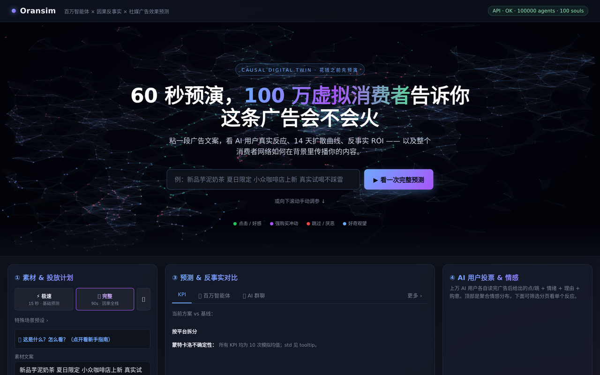
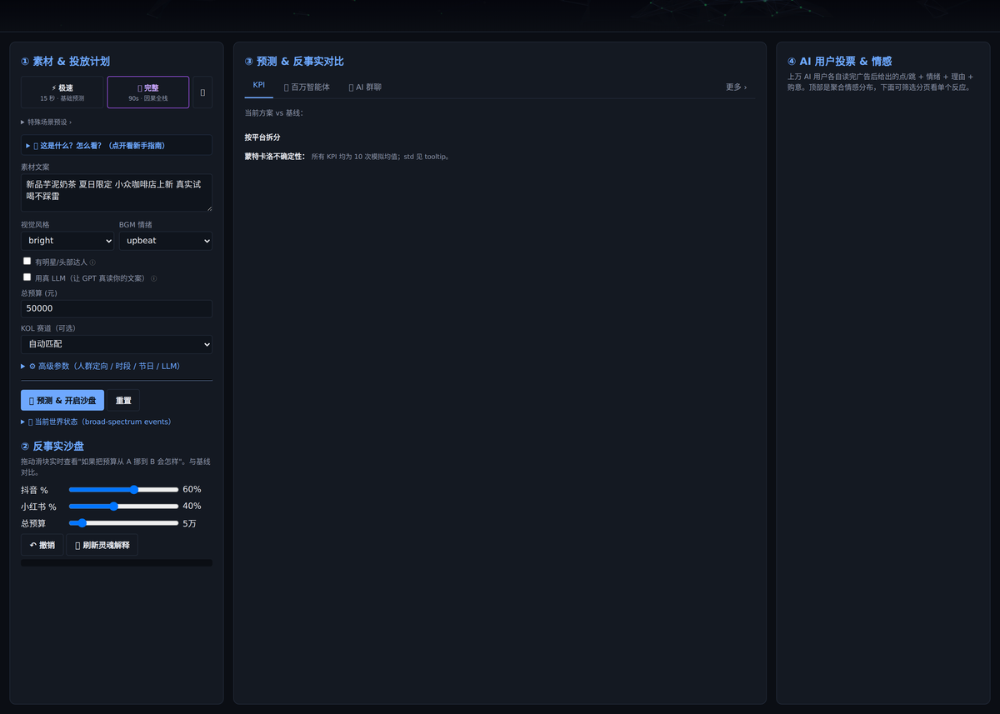
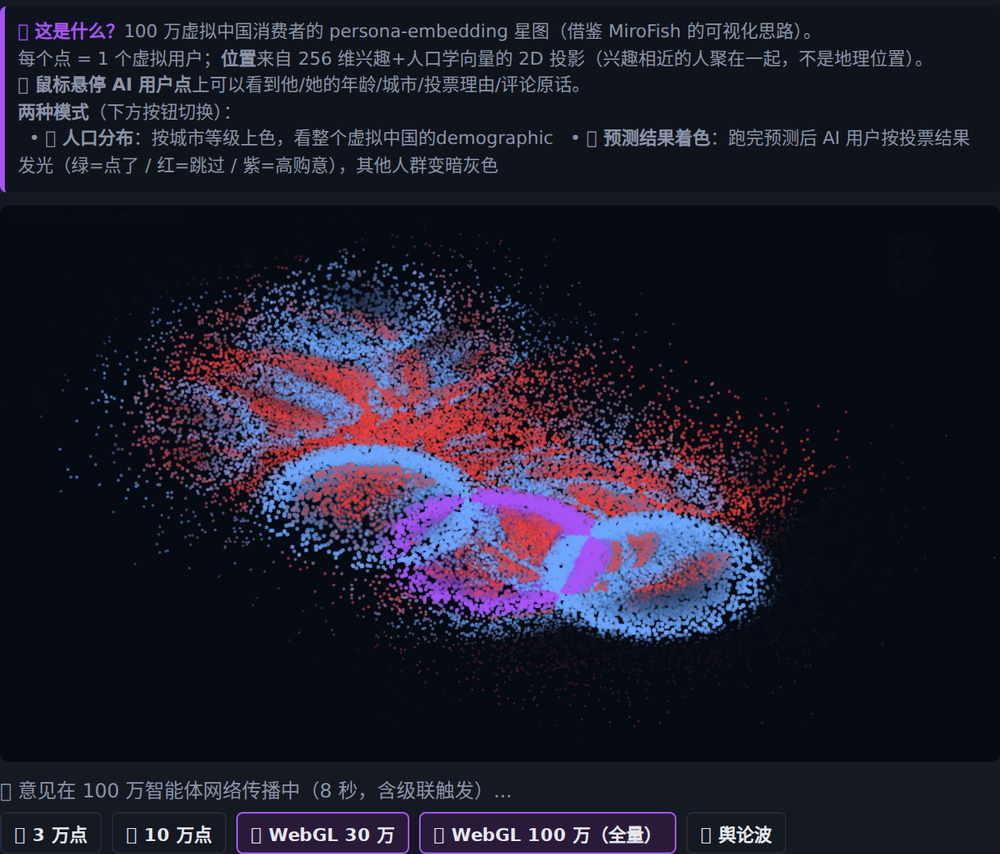

<div align="center">


### 一分钱还没花，就先算清楚这次投放的回报。

<p>
  <a href="https://github.com/OranAi-Ltd/oransim/blob/main/LICENSE"></a>
  <a href="https://github.com/OranAi-Ltd/oransim/releases"></a>
  <a href="#"></a>
  <a href="https://github.com/OranAi-Ltd/oransim/actions/workflows/ci.yml"></a>
  <a href="https://github.com/OranAi-Ltd/oransim/stargazers"></a>
  <a href="https://oran.cn"></a>
</p>

<p>
  <a href="README.md">🇬🇧 English</a> · <strong>🇨🇳 中文</strong>
</p>

<p><em>企业级因果仿真 · 面向品牌 growth 团队<br/>先看代码，再谈数据。</em></p>
</div>

---

<p align="center">

</p>

**企业 CMO 专用** —— 一次投放花钱之前，先算清楚 ROI：**300 万+ 小红书真实帖 · 1 万+ KOL · 2 万+ KOC · 10 万+ 真实用户样本**，通过正规授权平台接口每日更新。跑在 **100 万+ 虚拟消费者社会**上的因果推理引擎，LLM 灵魂人格读你真实的素材给反应。因果逻辑透明，开源出来给你先审再授权数据。

*这个 OSS 仓库就是同一套因果引擎，跑在 2.1 万条 demo 语料上 —— 先上手、端到端审机制，再找 `cto@orannai.com` 开 Enterprise 数据授权。*

---

## 我们是谁

**OranAI 橙果视界（深圳）科技有限公司** —— 深圳南山的 AI 营销公司，成立于 2024 年 5 月，已完成**数千万元人民币**融资，由[云天使基金领投，力合创投、金沙江联合资本跟投](https://36kr.com/p/3442645125141897)，与腾讯云联合共建 [AIGC 设计实验室](https://caijing.chinadaily.com.cn/a/202412/26/WS676d01b5a310b59111daaff3.html)。自研多模态模型矩阵（**Oran-VL 7B** / **Oran-XVL 72B**）驱动三条产品线 —— **PhotoG** 创意智能体 · **DataG** 洞察引擎 · **VoyaAI** 策略 copilot，服务 **70+ 企业客户**（美妆 / 快消 / 消费电子 / DTC 出海），含 Timekettle、[现代汽车 Pharos IV Best Prize 获奖合作](https://m.tech.china.com/articles/20260117/202601171798695.html)，**2025 年营收突破 2000 万**。

**Oransim 就是那一套的因果引擎。** 客户问*"如果第 3 天把 KOL A 换成 KOL B 会怎样？"* —— 回答这个问题的 `do()` 算子、per-arm 反事实头、14 天 Hawkes 扩散 rollout，全在这个仓库里。我们以 Apache-2.0 协议开源，让企业买方能端到端自己审 —— **先看代码，再谈数据。**

<sub>媒体报道：[PR Newswire](https://www.prnewswire.com/news-releases/oranai-raises-multi-million-dollar-angel-funding-to-lead-ai-content-marketing-through-its-ai-agent-photog-302548911.html) · [亿邦动力](https://www.ebrun.com/20250520/579947.shtml) · [新浪科技](https://finance.sina.com.cn/tech/roll/2024-11-26/doc-incxkhus4289659.shtml) · [腾讯新闻](https://news.qq.com/rain/a/20250714A07JHO00) · [DoNews](https://www.donews.com/news/detail/5/3670706.html)</sub>

---

## 它能解决什么

三个传统工具各解一点、但 Oransim 一套搞定的 campaign 决策：

### 1. 上线前 · 算账
> *"我有 4 个创意视频 × 3 套 KOL 组合 × 2 个预算档，哪个组合 ROI 最高？"*

传统做法：A/B 实际测 2 周，烧 ¥50 万才知道。**Oransim**：60 秒仿真、¥0 成本，24 种组合按 P35/P65 区间排序，挑最好的 3 个再真测。

### 2. 投放中 · 改策略
> *"第 3 天 CTR 没达标。能换掉 2 个 KOL、把预算给另外 3 个吗？ROI 会变多少？"*

传统做法：数据团队连夜搭 dashboard。**Oransim**：`do(kol=swap_A_for_B, day=3)` 反事实 rollout 30 秒出结果，给你干预后的 14 天路径差。

### 3. 复盘 · 反事实
> *"这次 campaign ROI 翻车了。当时预算给到小红书而不是抖音，会怎样？"*

传统做法：事后归因，结论含糊。**Oransim**：loadloaded 实际数据 + `do(platform_alloc={xhs: 1.0})`，在同一个 agent 群体上跑出反事实 ROI 曲线，明确知道"当时换了会怎样"。

三个决策跑在同一个引擎上。下面讲它怎么搭的、凭什么信。

---

## 为什么现有工具答不了这三个问题

每个营销智能工具都只答了一部分。没有一个能在同一套数据上答齐这三问：

| 3 个 CMO 问题 | 现有工具在做什么 | 缺什么 |
|---|---|---|
| **上线前**在 24 种 creative × KOL × 预算组合里排序 | 传统 **Marketing Mix Modeler** 拟合总收入曲线 —— 每期一个总量数字 | 不告诉你**哪个组合** —— MMM 给总量，不给 per-arm 反事实 |
| **投放中**换一个 KOL 会怎样？ | **CDP（客户数据平台）**只报已发生的 —— 点击漏斗、留存分层 | 不能在 `do()` 下向前 roll —— DMP 是观察性的、不是因果的 |
| **复盘**如果当时换了平台预算分配会怎样？ | **黑盒预测器**（AutoML / LLM "预测 ROI"）给你一个数字，没推导 | 没法 audit 推理 —— SHAP 图 ≠ 因果图 |

Oransim 就在这个缺口上：**per-arm 反事实**（上线前排序）· **时间维度的 `do()`-rollout**（投放中换策略）· **可审的因果图**（复盘归因）。一个引擎，三个决策。

---

## 凭什么信它 · 三种信号，选你 stakeholder 在意的那个

### 🔬 机制 · 自己审代码

你看的这个 OSS 仓库就是**完整的因果引擎**，不是营销 demo。git clone、在自己场景上跑、把任意一个预测追溯到 64 节点因果图里哪个 agent 决策 + 哪段 budget 曲线算出来的。不是"信我们这是 ML"—— 每个预测都能拆开看。

```bash
git clone https://github.com/OranAi-Ltd/oransim.git && cd oransim
pip install -e '.[dev]' && python -m uvicorn oransim.api:app --port 8001 &
curl http://localhost:8001/api/graph/inspect   # 因果图的 JSON 表示
```

### 📊 数据 · Enterprise 授权能拿到的

OSS 附带 2.1 万帖参考语料 —— 够验证机制，不够跑生产 campaign。Enterprise Edition 跑在持续更新的授权数据面板上：

| 数据资产 | 规模 | 来源 |
|---|---|---|
| 小红书帖子 | **300 万+**，每日刷新 | 正规授权平台接口 + 自研爬虫 |
| KOL 档案 | **1 万+**，覆盖 **15 个赛道** —— 美妆 · 护肤 · 穿搭 · 3C · 食饮 · 母婴 · 家居 · 汽车 · 汽车后市场 · 健身 · 理财 · 奢品 · 宠物 · 医美 · 旅行 | 头部 + 腰部，带粉丝画像 |
| KOC 档案 | **2 万+**，腰部影响力（1k-5w 粉），近 30 天活跃 | 主动招募 + 平台信号 |
| 真实用户样本 | **10 万+** 小红书认证用户，按月调研 | 主动招募 |

*联系 [`cto@orannai.com`](mailto:cto@orannai.com?subject=Oransim%20Enterprise%20数据授权) 开通 Enterprise 数据访问。*

### 📚 研究 · 12 年技术谱系支撑每一层

Oransim 不是"拍脑袋 LLM"—— 每层都追溯到 2010–2024 同行评议文献：

<details>
<summary>架构 + 研究谱系（点开展开）</summary>

- **Per-arm 反事实头** —— TARNet (Shalit ICML 2017) · Dragonnet (Shi NeurIPS 2019)
- **表征平衡损失** —— HSIC (Gretton 2005) · adversarial-IPTW · BCAUSS · CaT (Melnychuk ICML 2022)
- **In-context 摊销** —— CInA (Arik & Pfister NeurIPS 2023)
- **因果神经 Hawkes 过程** —— Mei & Eisner NeurIPS 2017 + Zuo ICML 2020 + Geng NeurIPS 2022 counterfactual TPP
- **预算曲线** —— Hill 饱和 (Dubé & Manchanda 2005) + 频次疲劳 (Naik & Raman 2003)
- **SCM** —— Pearl 3 步（溯因 → 干预 → 预测），64 节点 / 117 边，含话语 + 级联 mediator (Sunstein 2017 · Bikhchandani 1992)
- **Agent 人口** —— IPF / Deming-Stephan 1940 baseline

详见 `backend/oransim/{world_model,diffusion,causal}/` —— 每个文件内嵌 citations。
</details>

---

## 🚀 一分钟上手

```bash
# 1. 克隆 + 安装
git clone https://github.com/OranAi-Ltd/oransim.git
cd oransim
pip install -e '.[dev]'

# 2. 启动后端（mock 模式 —— 不需要 API key）
LLM_MODE=mock python -m uvicorn oransim.api:app --port 8001 &

# 3. 启动前端
python -m http.server 8090 --directory frontend

# 4. 浏览器打开 http://localhost:8090 → 点 "⚡ 极速" → "🚀 预测"
```

Mock 模式走模板，没 LLM 调用——能跑通但 soul persona / 群聊 / 评论区辩论 / LLM 校准全部退化。**切真 LLM：**

```bash
LLM_MODE=api \
LLM_API_KEY=sk-xxxxx \
LLM_MODEL=gpt-5.4 \
python -m uvicorn oransim.api:app --port 8001 &
```

`LLM_PROVIDER` 选原生格式，默认 `openai`（也覆盖 DeepSeek / vLLM / 任何 OpenAI-compat 网关）：

<details>
<summary>各 provider 推荐配置（点开展开）</summary>

| `LLM_PROVIDER` | `LLM_BASE_URL` | `LLM_MODEL` 示例 | 关键 env |
|---|---|---|---|
| `openai`（默认） | `https://api.openai.com/v1` | `gpt-5.4` · `gpt-4o-mini` | `OPENAI_API_KEY` 或 `LLM_API_KEY` |
| `openai`（DeepSeek） | `https://api.deepseek.com/v1` | `deepseek-chat` | `LLM_API_KEY` |
| `openai`（本地 vLLM） | `http://localhost:8000/v1` | 任意已挂载的模型 | `LLM_API_KEY=local` |
| `anthropic` | 默认官方 | `claude-sonnet-4-6` | `ANTHROPIC_API_KEY` 或 `LLM_API_KEY` |
| `gemini` | 默认官方 | `gemini-2.5-pro` · `gemini-2.5-flash` | `GEMINI_API_KEY` / `GOOGLE_API_KEY` / `LLM_API_KEY` |
| `qwen` | `https://dashscope.aliyuncs.com/api/v1`（默认） | `qwen-plus` · `qwen-turbo` | `DASHSCOPE_API_KEY` / `QWEN_API_KEY` / `LLM_API_KEY` |

完整参考：[`.env.example`](.env.example)；重试 / 降级 fallback 细节见 [`docs/zh/quickstart.md`](docs/zh/quickstart.md)。

</details>

前端检测到后端还是 mock / 没 key 时，顶部会弹一条黄色 banner 贴启动命令 · 点 ✕ 本会话不再显示。

> **现在能跑到什么程度 · 真实 vs aspirational**
> - ✅ **今天就能跑** —— 完整后端（`POST /api/predict` · `/api/adapters` · `/api/sandbox/*`，api.py 已从 1730 行拆成 `api_routers/` 8 个子 router）· 完整前端（hero · 9 tab · 级联动画 · 模块化 `js/*.js`）· 预训 LightGBM quantile baseline pkl · 5 个 platform adapter（XHS v1 legacy + TikTok agent-level 带 FYP 冷启 RL + IG / YouTube Shorts / Douyin MVP）· learned amortized abduction（纯 numpy MLP q(U|O)）· 多 LLM provider（OpenAI-compat · Anthropic · Gemini · Qwen）
> - 🟡 **代码已 ship，权重待发** —— 因果 Transformer 世界模型 + 因果神经 Hawkes 扩散模型 —— 架构 + 训练 loop + 推理 + thinning 采样全部 ship；预训权重随 OrancBench v0.5 发布
> - 📋 **仅路线图** —— Twitter / Bilibili / LinkedIn adapter · 多模态 embedder（当前只 image/video/audio stub）· Ray 集群 · hosted demo

---

## 🎬 实际效果

<table>
<tr>
<td width="50%" valign="top">

**三栏工作界面** —— 左：素材 + 预算 + 反事实滑块 · 中：KPI / Agent 人口池 / AI 群聊 tab（「更多 ›」下拉藏着 Hawkes / SCM / CATE / Schema 等深度视图）· 右：逐 persona 的 LLM 反应。



</td>
<td width="50%" valign="top">

**agent 网络中的意见传播** —— 粘入广告文案，观察四色意见波（绿=点击 / 紫=强购意 / 红=跳过 / 蓝=好奇）从 KOL 种子向外扩散，级联感染粉丝。



</td>
</tr>
</table>

---

## 🏗️ 架构

<div align="center">

</div>

一次典型预测链路：**素材 + 预算** → **PlatformAdapter**（经可插拔 **DataProvider** 取数据）→ **世界模型**（事实 + 反事实预测）+ **Agent 层**（POP_SIZE-scalable IPF + LLM 人格）→ **因果引擎**（64 节点因果图 + `do()` 反事实）→ **扩散**（14 天干预感知 rollout）→ **预测 JSON**（14-19 个 schema）。

**默认走哪条 / 研究栈怎么开：**

| 位置 | 开箱默认 | 研究栈（opt-in） |
|---|---|---|
| 世界模型 | LightGBM 量化 baseline（`data/models/world_model_demo.pkl`）+ 手写结构化公式 | `CausalTransformerWorldModel`（CaT / TARNet / Dragonnet / CInA）— 本地训或 `POST /api/v2/world_model/predict?model=causal_transformer` 切换 |
| 扩散 | 参数化指数核 Hawkes (Hawkes 1971) | `CausalNeuralHawkesProcess`（Mei & Eisner + Zuo et al. + Geng et al.）— 同样 opt-in：`POST /api/v2/diffusion/forecast?model=causal_neural_hawkes` |
| Agent | `StatisticalAgents`（向量化，CPU） | `SoulAgentPool` LLM 人格（`/api/predict` 勾 `use_llm=true`） |
| 沙盘 | 只改预算时用 Hill 饱和 + 频次疲劳闭式公式快算（response 里 `mode: "fast_approx"` 标出来），滑块响应快；改创意 / alloc / KOL 触发真实重跑（`mode: "counterfactual"` 或 `"full_rerun"`）。 | — |

*registry 是扩展点。默认 `/api/predict` 走 baseline 栈是因为它今天就带权重能跑；`/api/v2/*` 是训好权重后 A/B 切到研究栈的路径。两条路径共用同一套 SCM / agent / Hawkes 管道。*

两轴可扩展：
- **平台轴** —— XHS（v1 legacy 直接可跑）+ TikTok / Instagram / YouTube Shorts / Douyin（合成数据 MVP）；Twitter / Bilibili / LinkedIn 在路线图
- **数据轴** —— 每平台多数据源插件（Synthetic / CSV / JSON / OpenAPI / 自定义）

完整设计见 [`docs/zh/architecture.md`](docs/zh/architecture.md)。

---

## 🌐 平台 Adapter 矩阵

| 平台                 | 区域      | 状态    | 数据源                                | 世界模型              | 里程碑 |
|----------------------|-----------|---------|---------------------------------------|-----------------------|--------|
| 🔴 小红书 / XHS      | 大中华区  | ✅ v1   | Synthetic / CSV / JSON / OpenAPI    | 因果 Transformer + LightGBM baseline | — |
| ⚫ TikTok            | 全球      | 🟢 MVP  | Synthetic                            | LightGBM baseline     | v0.5（接真 panel） |
| 🟣 Instagram Reels   | 全球      | 🟢 MVP  | Synthetic                            | LightGBM baseline     | v0.5（接真 panel） |
| 🔴 YouTube Shorts    | 全球      | 🟢 MVP  | Synthetic                            | LightGBM baseline     | v0.5（接真 panel） |
| 🔵 抖音 / Douyin     | 大中华区  | 🟢 MVP  | Synthetic                            | LightGBM baseline     | v0.5（接真 panel） |
| ⚪ Twitter / X       | 全球      | 📋 规划 | —                                    | —                     | v0.5 |
| 📺 Bilibili          | 大中华区  | 📋 规划 | —                                    | —                     | v1.0 |
| ✒️ LinkedIn          | 全球      | 📋 规划 | —                                    | —                     | v1.0 |

**想要其他平台？** 提 [Adapter Request](https://github.com/OranAi-Ltd/oransim/issues/new?template=adapter_request.yml) —— 我们根据社区需求优先级排序。

---

## 📊 输出 Schema（14-19 个）

一次 `/api/predict` 调用返回下列 schema：

1. **total_kpis** —— 总曝光 / 点击 / 转化 / 成本 / 收入 / CTR / CVR / ROI（P35/P50/P65 区间）
2. **per_platform** —— 各平台 KPI 分解
3. **per_kol** —— KOL 层面归因
4. **diffusion_curve** —— 14 天日维度曝光/互动预测（因果神经 Hawkes 主预测器，参数化 Hawkes 作为 baseline）
5. **cate** —— 条件平均处理效应（按 agent 人口学切片）
6. **counterfactual** —— 反事实分支：换素材/加预算/换 KOL 的对比
7. **soul_feedback** —— 10 个 LLM 人格的自然语言反馈
8. **group_chat** —— 群聊动态模拟（Sunstein 2017 群体极化）
9. **discourse** —— 二次传播 mediator 影响估计
10. **final_report** —— LLM 生成的执行摘要
11. **verdict** —— 一句话决策建议（放行/优化/毙掉）
12. **kol_optimizer** —— 目标下的最优 KOL 组合
13. **kol_content_match** —— 素材 × KOL 匹配打分
14. **tag_lift** —— tag/定向选择的增量贡献
15. **mediator_impact** —— 从 discourse/group_chat 到漏斗的路径分析
16. **brand_memory** —— 纵向品牌偏好更新
17. **sandbox_snapshot** —— 会话快照，支持"撤销/重做"
18. **audit_trace** —— 可解释性 —— 哪些 agent、哪些路径、哪些权重
19. **benchmark** —— OrancBench 比对分数

JSON schema 定义见 [`docs/zh/schemas/`](docs/zh/schemas/)。

---

## 🧠 技术细节

<details id="causal-graph">
<summary><b>因果图</b> —— 64 节点 · 117 边</summary>

图是由领域专家手工设计的，覆盖营销漏斗从 曝光 → 认知 → 考虑 → 转化 → 复购 → 品牌记忆，包含群体话语（Sunstein 2017）和信息级联（Bikhchandani et al. 1992）的 mediator。

图里含长周期反馈回路（例如 `repeat_purchase → brand_equity → ecpm_bid → 下一轮 impression_dist`）。这是**故意的**——反映真实营销物理，不是建模瑕疵。严格 Pearl 式 abduction 在 cycle 上没定义；我们的 `do()` 求值用 Bongers 等 2021 的 cyclic-SCM 推广（[Foundations of Structural Causal Models with Cycles and Latent Variables](https://arxiv.org/abs/1611.06221)），把 25 节点反馈 SCC 当作不动点求解，而不是拓扑前向传播。

代码里的 3 步走法：
1. **溯因** —— agent 层重用 baseline 的采样噪声；图层面每节点残差 frozen
2. **干预** —— 应用 `do()`（可干预节点集见 `/api/dag` 响应里的 `intervenable: true`）
3. **预测** —— 对无环 condensation 拓扑排序，每个 SCC 用数值迭代（shipped 图上实测 2–3 遍收敛）

时间展开的 DAG 投影 OSS 版已 ship — `oransim.causal.scm.dag_dict_unrolled(n_steps=K)`：原图每个节点变成 `N_t0, N_t1, ..., N_t{K-1}`，反馈边跨时间（`src_ti → dst_t{i+1}`），非反馈边在每个切片内复制。`n_steps=2` 时 shipped 图的 64 节点 + 117 边（cyclic）展开成 128 节点 + 220 边（严格 DAG · 14 条反馈边通过 DFS 回边分析自动检测）。需要严格无环的下游（真 DAG 上的 CausalDAG-Transformer attention、教科书 Pearl 三步 abduction）可以用这个展开视图。cyclic 原图 + SCC 凝缩仍是默认路径，因为节点数小、和 Transformer 7-token 输入对齐。

针对 cyclic 原图的完整 equilibrium solver 是企业版升级项；OSS 用时间展开路径提供无环替代。
</details>

<details>
<summary><b>Agent 人口池</b> —— 可配置规模（`POP_SIZE` env，默认 100k，生产可扩到百万级）的 IPF 校准虚拟消费者</summary>

通过迭代比例拟合（IPF / Deming-Stephan 1940）对齐真实中国人口学分布（年龄 × 性别 × 地域 × 收入 × 平台）。每个 agent 带：
- 人口学 + 心理画像
- 平台专属互动先验
- 品类/niche 亲和向量
- 时段活跃曲线
- 社交图 embedding
</details>

<details>
<summary><b>灵魂 Agent</b> —— 1 万个 LLM 人格给定性反馈</summary>

每个场景取最显著的 top-K agent（`SOUL_POOL_N` 可配，默认 100 演示，Enterprise Edition 用 Ray 扩）升级为 LLM 驱动的人格，默认模型 `gpt-5.4`。每个人格：
- 从人口学向量生成 persona card
- 对素材给出反应 / 情绪 / 意图
- 可选加入群聊模拟（Sunstein 2017 群体极化）
- 二次传播信号反哺因果图

**两种模式，权衡讲清楚**：

- **模板模式**（`use_llm=False`，默认）—— 点击决策是统计层 `click_prob` 的 Bernoulli 抽样（垂类匹配时 +40%）；persona 配上与决策一致的模板 ``reason`` / ``comment`` / ``feel``。零 LLM 成本，给定 seed 可复现，用于 CATE / ROI 数值可复现场景。
- **LLM 决策模式**（`use_llm=True`，Park et al. 2023 Generative Agents 风格）—— 真实 LLM 拿到完整 persona card + 素材 + KOL 上下文，返回结构化 JSON（`will_click` / `reason` / `comment` / `feel` / `purchase_intent_7d`）。**LLM 的 ``will_click`` 就是 agent 的决策**（不被 Bernoulli 覆盖）；统计层 `click_prob` 作为 prompt 里的先验供 LLM 参考。响应打 `source: "llm"` 标签。权衡：每个 persona 带非确定性；需要严格复现时留模板模式或设 `LLM_TEMPERATURE=0`。

成本控制：
- 请求去重（leader/follower 合并同 key 请求）
- Persona card 缓存
- 可配 `SOUL_POOL_N`
</details>

<details id="causal-transformer-world-model">
<summary><b>因果 Transformer 世界模型</b> —— 主模型（研究级）</summary>

一个 6 层 × 256-dim 的因果 Transformer，吃异构 campaign 特征，输出每个漏斗 KPI 的三个分位数（P35/P50/P65）。架构结合近年因果 Transformer 文献：

- **Token 类型分解**（CaT, Melnychuk et al. ICML 2022）—— 输入分为 *Covariate*（平台、人口学、时段）· *Treatment*（素材 embedding、预算、KOL）· *Outcome*（KPI）三类 token，各自带独立 type embedding
- **DAG-aware 注意力**（CausalDAG-Transformer）—— 注意力 mask 从 64 节点因果图派生，每个 token 只能 attend 到拓扑祖先；每个 head 学一个 bias 门控。图有长周期反馈回路（见[§因果图](#causal-graph)），所以祖先关系定义在 **SCC 凝缩（condensation）** 之上：反馈 SCC 内节点互为祖先，SCC 之间用标准 DAG 祖先关系（Bongers 2021 §3.2）。参考实现在 `CausalTransformerWorldModel.set_dag_from_edges()`，`dag_attention_bias=True` 可以切开；OSS 版默认走 LightGBM baseline 路径，**接入 DAG 注意力的预训练 CT 权重随企业版发布**（见[§企业版](#enterprise)）。
- **Per-arm 反事实头**（TARNet, Shalit et al. ICML 2017 / Dragonnet, Shi et al. NeurIPS 2019）—— 每个离散 treatment arm 一个分位数 head，单次 forward 同时算 `predict_factual` 和 `predict_counterfactual(do(T=t'))`
- **表征平衡正则**（BCAUSS + CaT）—— HSIC（Gretton et al. 2005）或对抗 IPTW loss 把学到的表征和 treatment 分配解耦，降低反事实偏差
- **In-context 摊销**（CInA, Arik & Pfister NeurIPS 2023，可选）—— 模型可以条件于一组历史 campaign 做 amortized zero-shot 因果推断

核心类：`oransim.world_model.CausalTransformerWorldModel`。v0.2.0-alpha 已含完整训练 loop、反事实 rollout、save/load；预训权重随 OrancBench v0.5 发布。

```python
from oransim.world_model import get_world_model, CausalTransformerWMConfig

wm = get_world_model("causal_transformer", config=CausalTransformerWMConfig(
    dag_attention_bias=True,
    balancing_loss="hsic",
    use_counterfactual_head=True,
))
pred = wm.predict(features)                         # 事实预测
cf = wm.counterfactual(features, arm_idx=2)         # do(T = arm 2) 反事实
```

*需要* `pip install 'oransim[ml]'`（装 PyTorch）。torch 不可用时优雅降级到 LightGBM baseline。
</details>

<details>
<summary><b>通用 Embedding Bus (UEB)</b> —— 现在只做文本，v0.5 接多模态</summary>

所有数据源（素材文案、KOL 个签、用户评论、粉丝画像表格、平台事件流）都走统一的 `Embedder` ABC，输出固定维度向量。下游模块（世界模型 / agent / causal 层）从来见不到 modality 特定代码 —— registry 本身就是 modality-generic。

**v0.2 已 ship**：
- `RealTextEmbedder` —— OpenAI 兼容的 `text-embedding-3-small`，复用 soul_llm 的同一个网关（一个 key 搞定）。API 不可用时自动降级到确定性 hash embedder。
- `TabularEmbedder` · `CategoricalEmbedder` · `TimeSeriesEmbedder` · `GeoEmbedder` · `EventEmbedder` —— 非学习 baseline。

**v0.5 留的桩**（调用会 raise `NotImplementedError` 指向 ROADMAP.md#v05）：
- `ImageEmbedderStub` —— 计划 backend：CLIP / Qwen-VL / SigLIP / ImageBind
- `VideoEmbedderStub` —— 计划 backend：I-JEPA v2 / TimeSformer / VideoMAE v2 / Qwen-VL 视频模式
- `AudioEmbedderStub` —— 计划 backend：Whisper-v3 encoder / CLAP / AudioMAE

接入真实实现是一个 ~50 行的 `Embedder` 子类，下游零改动。详见 `backend/oransim/runtime/embedding_bus.py`。

</details>

<details>
<summary><b>LightGBM 分位数世界模型</b> —— 快速 baseline</summary>

每个 KPI 3 个分位数回归器（P35 / P50 / P65）。亚毫秒推理、无 GPU 需求。参考：Ke et al. 2017（LightGBM）、Koenker 2005（分位数回归）。

**shipped pkl**（`data/models/world_model_demo.pkl` · `feature_version: demo_v2` · ~3 MB）吃 **23 维特征**：7 标量（`platform_id` / `niche_idx` / `budget` / `budget_bucket` / `kol_tier_idx` / `kol_fan_count` / `kol_engagement_rate`）+ 16 维 PCA 降维的 text embedding。Embedding 输入是每个场景一条确定性 caption（`"春季 {niche} 新品种草 · {tier} KOL · {budget_bucket}"`），过 `RealTextEmbedder` 拿到 embedding —— 和 UEB / soul agent persona 匹配 / `kol_content_match` / `search_elasticity` 用的是同一个 embedder。设了 `OPENAI_API_KEY` 就打 `text-embedding-3-small`；没 key 就落到 SHA-256 哈希 fallback embedder（确定性），训练/推理都能 offline 复现。PCA 分量存在 pkl 里，推理时走 `POST /api/v2/world_model/predict?model=lightgbm_quantile` 自动应用。2000 条合成场景里 200 条留出集 R²：impressions 0.88 · clicks 0.79 · conversions 0.71 · revenue 0.75。

Causal Transformer 路径原生吃完整维度的 creative embedding（不 PCA），等 OrancBench v0.5 权重发布就直接能用；当前这个 demo LightGBM pkl 是 CPU-only fallback。

```python
wm = get_world_model("lightgbm_quantile")
```
</details>

<details>
<summary><b>预算模型</b> —— Hill 饱和 + 频次疲劳</summary>

不是简单线性扩预算，而是：

$$\text{effective\_impr\_ratio}(x) = \frac{(1+K) \cdot x}{K + x}$$

Michaelis-Menten / Hill 饱和（Dubé & Manchanda 2005），叠加 CTR/CVR 上的频次疲劳（Naik & Raman 2003）：

$$\text{ctr\_decay}(r) = \max(0.5, 1.0 - 0.08 \cdot \max(0, \log_2 r))$$

捕捉到了：边际递减、最优预算点、真实投放曲线。
</details>

<details id="causal-neural-hawkes-process">
<summary><b>因果神经 Hawkes 过程</b> —— 主扩散预测器</summary>

Transformer 参数化的神经时序点过程，预测 14 天级联互动，第一等支持 `do()` 干预下的反事实 rollout。

架构参考：

- **Mei & Eisner (NeurIPS 2017)** —— *The Neural Hawkes Process* —— 连续时间神经强度函数，领域奠基作
- **Zuo et al. (ICML 2020)** —— *Transformer Hawkes Process* —— 把原版 CT-LSTM 换成 self-attention encoder；本实现的架构骨架
- **Shchur et al. (ICLR 2020)** —— *Intensity-Free Learning of TPPs* —— closed-form inter-event-time head，快采样
- **Chen et al. (ICLR 2021)** —— *Neural Spatio-Temporal Point Processes* —— log-likelihood compensator 的 Monte Carlo 估计
- **Geng et al. (NeurIPS 2022)** —— *Counterfactual Temporal Point Processes* —— 带标记的点过程的干预语义
- **Noorbakhsh & Rodriguez (2022)** —— *Counterfactual Temporal Point Processes* —— 事件流上 `do()` 查询的形式化

显式区分 treatment/control 事件类型（`organic` vs `paid_boost`）+ 干预感知的强度 decoder，支持「假如第 3 天停止加热会怎样」这类查询，走反事实 rollout loop。

核心类：`oransim.diffusion.CausalNeuralHawkesProcess`。v0.2.0-alpha 已含完整架构 + 训练 loop（NLL + MC compensator）+ 采样器（Ogata thinning）+ 反事实 rollout；预训权重随 OrancBench v0.5 发布。

```python
from oransim.diffusion import get_diffusion_model

nh = get_diffusion_model("causal_neural_hawkes")
factual = nh.forecast(seed_events=[(0, "impression"), (12, "like")])
cf = nh.counterfactual_forecast(
    seed_events,
    intervention={"mute_at_min": 4320}  # 3 天后停止加热
)
```

*需要* `pip install 'oransim[ml]'`。
</details>

<details>
<summary><b>参数化 Hawkes</b> —— 经典 baseline</summary>

指数核的多元 Hawkes 过程（Hawkes 1971）。闭式强度和对数似然；Ogata (1981) thinning 采样器。零依赖 fallback，也是 OrancBench 上因果神经 Hawkes 的对照。

```python
ph = get_diffusion_model("parametric_hawkes")
```
</details>

<details>
<summary><b>沙盘</b> —— 增量重算支持"如果换做法"</summary>

场景会话保留状态，用户可以迭代：「预算从 10 万改成 15 万，ROI 怎么变？」。只有预算变时不重跑全 agent 模拟；agent 池缓存复用；反事实评估用 union 语义在覆盖/未覆盖人群上做 CATE。
</details>

---

## 📈 性能

Phase 1 基线在 **10 万条合成数据**上训练 —— 详见 [`data/models/data_card.md`](data/models/data_card.md)。

| 指标 | R²（合成数据） | Baseline（线性） | 说明 |
|------|---------------|------------------|------|
| `second_wave_click`     | 0.30 | 0.18 | PRS quantile 中位数 |
| `first_wave_conversion` | 0.33 | 0.21 | PRS quantile 中位数 |
| `cascade_lift`          | 0.39 | 0.25 | 二次传播 mediator |
| `roi_point_estimate`    | 0.33 | 0.19 | 单发回归 |
| `retention_7d`          | 0.29 | 0.17 | 纵向 |

> ⚠️ **可复现性声明** —— 上面数字基于合成数据，真实表现依赖：（1）你选的 DataProvider 数据质量；（2）平台匹配度；（3）垂类行业。**OranAI 付费版**在真实自有数据上训练，效果另发（NDA 下）。

完整评估协议见 [`docs/zh/benchmarks/`](docs/zh/benchmarks/)。

---

## 🗺️ 路线图精选

完整路线见 [ROADMAP.md](ROADMAP.md)，分三个时间 horizon × 八个主题。精选：

**v0.2（2026 Q3）—— 预训权重发布**
- 📦 因果 Transformer + 因果神经 Hawkes 在 100k 合成数据上训好的 checkpoint
- TikTok + Douyin adapter MVP
- Docker Compose · MkDocs · CI

**v0.5（2026 Q4 – 2027 Q1）**
- 🎯 **跨平台迁移学习** —— XHS 预训 → TikTok fine-tune
- ✅ **多 LLM 原生格式** —— Anthropic Messages / Gemini / Qwen DashScope 已在 v0.2 落地；Bedrock Converse + 原生流式留在路线图
- 🎯 **10k 灵魂 Agent 跑 Ray 集群**
- ✅ Instagram / YouTube Shorts / Douyin adapter MVP

**v1.0+（2027）**
- 🎯 **因果基础模型 Causal Foundation Model** —— 千万级跨行业 campaign 预训练
- 🎯 **闭环 AI 投放优化** —— 带安全约束的实时 RL
- 🎯 **差分隐私 + 联邦学习** —— 品牌数据不出私域前提下训练
- 15+ 平台 · 多模态素材理解 · 垂类 sub-benchmark

---

## 🏢 OranAI Enterprise Edition

你看的这个 OSS 是**因果引擎**。Enterprise Edition 是**生产级版本** —— 真实数据面板 · SLA 托管推理 · 垂直校准 · 全程陪跑上线。

### 能力对照

| | Oransim OSS | OranAI Enterprise |
|---|---|---|
| **因果引擎** | ✅ Apache-2.0，完整源码 | ✅ 同一引擎 |
| **数据面板** | 2.1 万条 demo 小红书帖 + 3 千 KOL | **300 万+ 帖 · 1 万+ KOL · 2 万+ KOC · 10 万+ 真实用户样本**，每日刷新 |
| **垂类校准** | 通用先验 | **10+ 垂类** —— 美妆 · 3C · 汽车 · 奢品 · 医美 · ... 每个垂类独立的粉丝画像 + CPM 曲线校准 |
| **LLM 灵魂 agent** | 文本 LLM，用你自己 API key | 全多模态（图 + 视频 + 音频），驱动 Oran-VL 7B / Oran-XVL 72B |
| **托管推理** | 自部署 | 99.9% SLA · 秒级响应 · 全球加速 |
| **部署形态** | 本地 / 你自己的云 | 托管 · 私有化 · 混合 |
| **合规** | — | SOC 2 / ISO 27001 合规路径 · GDPR · 中国《个人信息保护法》 |
| **上线支持** | 自服务文档 | 白手套 —— 定制 adapter / 集成 / 培训 |
| **模型更新** | 社区节奏 | 托管式 —— 平台演进时零停机刷新 |

### 典型试点（2 周 · ¥0 承诺）

1. **Day 1-3 · 范围对齐** —— 从你正在跑的 campaign 里选 2-3 个作为测试场景
2. **Day 4-10 · 仿真推演** —— 你提供 创意 + KOL 短名单 + 历史 KPI → 我们跑反事实仿真 → 给出排序推荐
3. **Day 11-14 · 实盘验证** —— 你执行其中一条推荐上市 → 我们对比上线前预测 vs 实际 → 出校准报告

**退出条件**：我们的上线前 P35/P65 区间**覆盖真实 KPI ≥ 80%**。不达标，试点结束，不收费。达标，再谈定价。

### 联系

- **预约试点**：[`cto@orannai.com`](mailto:cto@orannai.com?subject=Oransim%20Enterprise%20试点) · 通常 24h 内回复
- **投资 / 合作**：同一邮箱，主题标记 `[Investor]` 或 `[Partner]`
- **媒体**：同一邮箱，主题标记 `[Press]`

---

## 🤝 贡献

我们欢迎各种贡献 —— 平台 adapter、世界模型改进、文档、benchmark、翻译、bug fix。

- **先看**：[CONTRIBUTING.md](CONTRIBUTING.md)
- **Commit 签名** 按 [DCO](CONTRIBUTING.md#developer-certificate-of-origin-dco)：`git commit -s`
- **新手友好 issue**：[按标签筛选](https://github.com/OranAi-Ltd/oransim/issues?q=is%3Aissue+label%3A%22good+first+issue%22)
- **平台 adapter 请求**：[在这里提](https://github.com/OranAi-Ltd/oransim/issues/new?template=adapter_request.yml)

贡献意味着同意以 Apache-2.0 License 发布。不用签 CLA。

---

## 📚 引用

研究中使用请这样引：

```bibtex
@software{oransim2026,
  author       = {{OranAI Ltd. and Oransim contributors}},
  title        = {Oransim: Causal Simulation for Enterprise Growth Teams},
  version      = {0.2.0-alpha},
  date         = {2026-04-18},
  url          = {https://github.com/OranAi-Ltd/oransim},
  organization = {OranAI Ltd.}
}
```

`cffconvert` 兼容的元数据见 [CITATION.cff](CITATION.cff)。

---

## 📜 License

Apache License 2.0 —— 详见 [LICENSE](LICENSE) 和 [NOTICE](NOTICE)。

`Copyright (c) 2026 OranAI Ltd. (橙果视界（深圳）科技有限公司) and Oransim contributors.`

第三方依赖保留各自 License。我们与小红书、字节跳动、Meta、Google 以及仓库中任何被提到的平台没有任何隶属关系。

---

## 💫 团队

由 **[OranAI Ltd.](https://oran.cn)** (橙果视界（深圳）科技有限公司) 出品。公司背景、融资、业务见上方 §[我们是谁](#我们是谁)。

### 核心维护者

**尹法空 (Fakong Yin)** · OranAI Ltd. CTO 兼核心架构师 · [`cto@orannai.com`](mailto:cto@orannai.com) · [@OranAi-Ltd](https://github.com/OranAi-Ltd)

本仓库因果引擎独立作者 —— 64 节点 Pearl SCM、per-arm 反事实 world model、因果神经 Hawkes 扩散层、Universal Embedding Bus、8 路由 FastAPI 后端、5 平台 adapter（小红书 · TikTok · 抖音 · Instagram Reels · YouTube Shorts）、LightGBM quantile baseline 训练管线、9 tab 生产前端。从营销策略 · 广告产品到因果 ML / RL / agent-based 模拟，再到后端与数据基础设施，端到端跨度在单个工程师身上罕见。

自证：`git log --author="Fakong Yin" --oneline | wc -l`。

**招聘中** —— 研究员（因果 ML · RL · agent-based 模拟）和工程师（平台 · 数据 · 基础设施）。投递 [`cto@orannai.com`](mailto:cto@orannai.com)。

贡献者名单在 [`CONTRIBUTORS.md`](CONTRIBUTORS.md)（自动生成）。

---

## ⭐ Star 历史

<a href="https://star-history.com/#OranAi-Ltd/oransim&Date">
  <picture>
    <source media="(prefers-color-scheme: dark)" srcset="https://api.star-history.com/svg?repos=OranAi-Ltd/oransim&type=Date&theme=dark" />
    <source media="(prefers-color-scheme: light)" srcset="https://api.star-history.com/svg?repos=OranAi-Ltd/oransim&type=Date" />
    
  </picture>
</a>

---

<div align="center">
在深圳用 ☕ 浇灌 · Built by <a href="https://oran.cn">OranAI</a>. Oransim 对你有用？点个 ⭐ 支持开源 —— 它是我们持续投入的动力。
</div>
